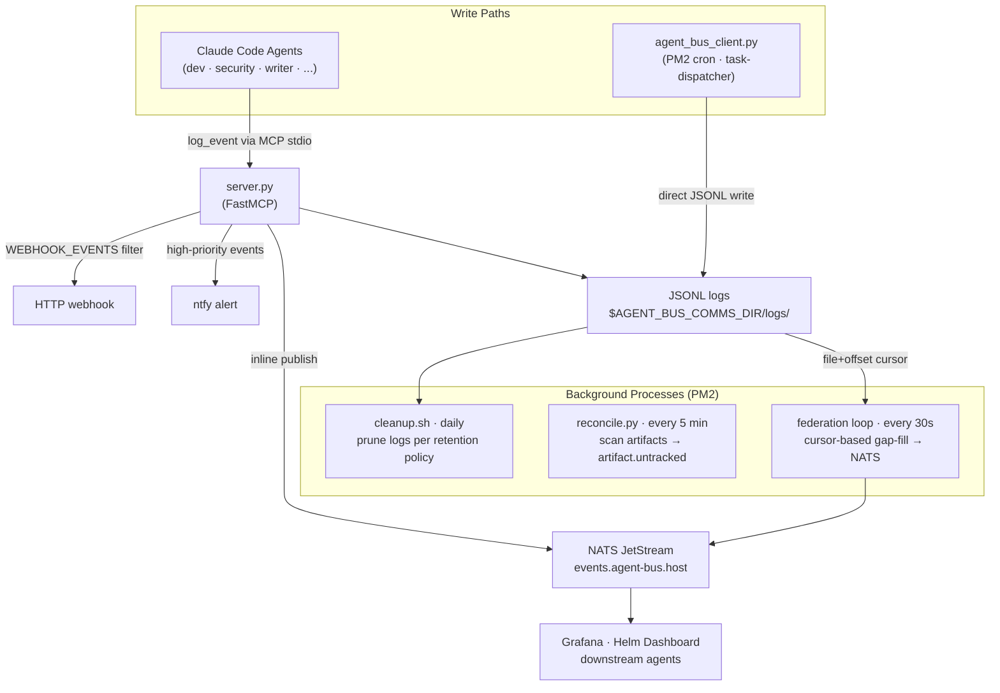

# agent-bus

[](https://claude.ai/code)
[](https://github.com/TadMSTR/agent-bus/actions/workflows/ci.yml)

A FastMCP server that provides a unified inter-agent event log for multi-agent Claude Code setups. Agents log communication events (task handoffs, audit requests, build completions) via MCP tools; events are written to local JSONL files and optionally federated to NATS JetStream for real-time observability.

## Why

When multiple Claude Code agents run concurrently — a dev agent, a security agent, a writer agent — they have no shared communication channel. Events like "the claudebox agent handed off a task to the security agent" exist only in session notes or memory files, with no queryable history.

`agent-bus` provides a lightweight event bus:
- Agents call `log_event` when they produce or consume work items
- Events are indexed in JSONL files by date and scope, chain-hashed so the log is tamper-evident
- A background federation loop replays events to NATS JetStream for downstream consumers —
  elected by an flock so exactly one process runs it, even when agent-bus is loaded as a module
  by several concurrent MCP clients
- A reconciler catches artifacts (build plans, audit requests, handoffs) that were created without a corresponding log event

## Optional Components

| Component | What it adds | Required? |
|-----------|-------------|-----------|
| NATS JetStream | Real-time event federation; stream replay for downstream consumers | No — local JSONL log works standalone |
| ntfy | Push notifications for high-priority events (task failures, audit requests) | No — events are still logged without it |
| HTTP webhook | POST event JSON to any URL on matching events — integrates with n8n, Home Assistant, Make.com, or any custom API | No |

The server operates fully without NATS, ntfy, and webhooks. Add them when you want real-time observability or push alerts.

## Architecture



## Modules

| Module | Role |
|--------|------|
| `server.py` | FastMCP server — the 5 tools above, plus the `federation_loop` background task |
| `event_log.py` | The single append path shared by every writer: `fcntl.flock` + `prev_hash` chaining + fsync |
| `event_vocab.py` | The single definition of the event vocabulary — server and client both import it, so they can't drift |
| `nats_publisher.py` | Persistent NATS connection on a background thread |
| `agent_bus_client.py` | Direct JSONL writer for non-MCP callers (see [Non-MCP Callers](#non-mcp-callers)) |
| `reconcile.py` | Scans the artifacts directory for files with no logged event |

## Installation

```bash
git clone https://github.com/TadMSTR/agent-bus ~/repos/agent-bus
cd ~/repos/agent-bus
python3 -m venv venv
venv/bin/pip install -r requirements.txt
```

Register with PM2:

```bash
pm2 start ecosystem.config.js
pm2 save
```

Configure as an MCP server in your Claude Desktop or Claude Code settings:

```json
{
  "mcpServers": {
    "agent-bus": {
      "command": "/path/to/agent-bus/venv/bin/python3",
      "args": ["/path/to/agent-bus/server.py"],
      "env": {
        "NATS_URL": "nats://localhost:4222",
        "NTFY_URL": "https://your-ntfy-server/your-topic"
      }
    }
  }
}
```

`NATS_URL` and `NTFY_URL` are optional — the server operates without them (local JSONL log only).

## Environment Variables

| Variable | Default | Description |
|----------|---------|-------------|
| `AGENT_BUS_COMMS_DIR` | `~/.claude/comms` | Base directory for logs, artifacts, cursors, and the key registry |
| `NATS_URL` | `nats://localhost:4222` | NATS server URL (optional) |
| `NATS_AGENT_BUS_USER` | `agent-bus` | NATS username for federation publishing |
| `NATS_AGENT_BUS_PASSWORD` | — | NATS password. Unset disables publishing entirely (no crash — the JSONL write stays authoritative) |
| `NTFY_URL` | — | ntfy topic URL for push notifications (optional) |
| `AGENT_BUS_CROSS_AGENT_RETENTION_DAYS` | `90` | Days to retain cross-agent log files |
| `AGENT_BUS_SESSION_RETENTION_DAYS` | `30` | Days to retain session log files |
| `AGENT_BUS_WEBHOOK_URL` | — | URL to POST event JSON to (optional) |
| `AGENT_BUS_WEBHOOK_EVENTS` | — | Comma-separated event types to fire on, or `*` for all (optional) |
| `AGENT_BUS_VERIFY_SIGNATURES` | `warn` | `warn` (log and accept) or `enforce` (reject unsigned events and events from unregistered sources) — see [Signing & Verification](#signing--verification) |
| `AGENT_BUS_SIG_MAX_AGE` | `300` | Freshness window, in seconds, for `sig_v: 2` signatures |
| `AGENT_BUS_FEDERATION` | `1` | Set `0` to disable the federation loop entirely |
| `AGENT_BUS_FEDERATION_INTERVAL` | `30` | Seconds between federation cycles |
| `AGENT_BUS_FEDERATION_MAX_EVENTS` | `500` | Cap on events published per federation cycle |
| `AGENT_BUS_FEDERATION_MAX_SECONDS` | `10` | Wall-clock cap per federation cycle |

Copy `.env.example` to `.env` and fill in the values you need. Blank values use the defaults shown above.

## MCP Tools

### `log_event`

Log an inter-agent communication event.

| Parameter | Type | Required | Description |
|-----------|------|----------|-------------|
| `event_type` | str | yes | Event vocabulary string (see below) |
| `source` | str | yes | Originating agent name |
| `summary` | str | yes | One-line human-readable description |
| `scope` | str | no | `"cross-agent"` (default) or `"session"` |
| `target` | str | no | Receiving agent name |
| `artifact_path` | str | no | Absolute path to related file |
| `metadata` | dict | no | Arbitrary key-value context |

Returns `{"id": "<uuid>", "logged": true, "scope": "<scope>"}`.

### `query_events`

Query the event log with optional filters.

| Parameter | Type | Default | Description |
|-----------|------|---------|-------------|
| `since` | str | none | ISO timestamp lower bound |
| `source` | str | none | Filter by source agent |
| `target` | str | none | Filter by target agent |
| `event_type` | str | none | Filter by event type |
| `scope` | str | `"cross-agent"` | Log file scope |
| `limit` | int | 50 | Max results (cap: 500) |

Returns events most-recent-first.

### `get_event`

Retrieve a single event by UUID.

### `get_status`

Returns the current server configuration and health: configured paths, which optional
integrations are active (NATS, ntfy, webhook), date range of available logs, and
event count for today. Use this to verify setup after installation. Integration URLs (NATS,
ntfy, webhook) have any embedded userinfo (`user:pass@`) stripped before being returned.

### `verify_chain`

Walks a JSONL log file and checks the SHA-256 hash chain for tampering or deletion. Returns
`{total_events, verified, chain_breaks, sig_failures, unsigned_events}`. Useful for
post-incident integrity checks — chain breaks indicate a line was inserted, removed, or edited
outside `log_event`/the client writers.

## Signing & Verification

Events can be signed with ed25519 and verified against a per-source key registry at
`$AGENT_BUS_COMMS_DIR/agent-keys.json`. `AGENT_BUS_VERIFY_SIGNATURES` controls what happens on a
signature problem:

- **`warn`** (default) — logs and accepts unsigned events and events from sources absent from
  the registry.
- **`enforce`** — rejects unsigned events and events claiming a source that isn't registered. A
  cryptographically invalid signature is rejected in *both* modes.

**What replay protection actually guarantees.** A captured, validly-signed event replayed
verbatim is not caught by the signature check alone — signing proves authorship, not freshness.
Signers declaring `sig_v: 2` include `sig_ts` and `sig_nonce` inside `metadata`, which is part of
the signed payload (see below), so neither can be forged or stripped without invalidating the
signature. The nonce cache that catches an exact replay is **per process**, and agent-bus
typically runs as one long-lived service plus one stdio child per MCP client — an event replayed
to a *different* process than the one that first saw it will not be caught by the nonce check.
The guarantee that holds across every process is the cryptographic freshness window: **a valid
signature, seen at most once per process, and at most ±`AGENT_BUS_SIG_MAX_AGE` seconds old** (the
window is symmetric to tolerate clock skew between agents). Size `AGENT_BUS_SIG_MAX_AGE` to the
replay exposure you're willing to accept, not to the nonce cache. Signers that predate `sig_v: 2`
are accepted but cannot be replay-checked.

Note that `ts`, `id`, `hostname`, and `prev_hash` are assigned by the server *after* the client
signs an event, so they cannot themselves be part of the signed payload — a client that wants
them covered signs `sig_ts`/`sig_nonce` in `metadata` instead, which the server does include in
what gets verified.

## Event Vocabulary

Events that automatically route to `cross-agent` scope regardless of the `scope` parameter:

| Event | When to use |
|-------|-------------|
| `task.dispatched` | Task written to agent queue |
| `task.approved` | Task approved for execution |
| `task.completed` | Task completed by agent |
| `task.failed` | Task failed or rejected |
| `task.routing-failed` | No agent manifest match found |
| `handoff.created` | Build plan or work item handed to another agent |
| `handoff.picked-up` | Agent picked up a handoff |
| `handoff.completed` | Handoff resolved |
| `audit.requested` | Security audit request written |
| `audit.completed` | Security audit report written |
| `build-plan.created` | New build plan added to queue |
| `diagnose.started` | Diagnostic session begun |
| `diagnose.completed` | Diagnostic session concluded |
| `artifact.untracked` | File in artifacts dir with no log entry (reconciler) |
| `preflight.started` | Build preflight check begun |
| `preflight.completed` | Build preflight check finished |
| `build.started` | Build phase execution begun |
| `build.completed` | Build phase execution finished |
| `deploy.started` | Deployment begun |
| `deploy.completed` | Deployment finished |
| `security.finding` | Security agent logged a finding |

High-priority events that also trigger a push notification: `audit.requested`, `task.failed`, `task.routing-failed`, `handoff.created`.

For session-scoped events (memory flushes, skill executions, etc.), use `scope="session"` — these go to a separate daily log file and are not federated to NATS.

## Storage Layout

```
$AGENT_BUS_COMMS_DIR/          (default: ~/.claude/comms)
├── logs/
│   ├── 2026-03-29-cross-agent.jsonl   # inter-agent events
│   └── 2026-03-29-session.jsonl       # session-scoped events
├── artifacts/
│   ├── build-plans/
│   ├── audit-requests/
│   ├── audit-reports/
│   ├── diagnose-sessions/
│   └── handoffs/
├── federation-cursor.json             # NATS federation offset tracker
└── .reconcile-cursor                  # reconciler mtime watermark
```

Each JSONL line is a complete event object:

```json
{
  "id": "a1b2c3d4-...",
  "ts": "2026-03-29T14:30:00+00:00",
  "event": "handoff.created",
  "scope": "cross-agent",
  "source": "claudebox",
  "target": "security",
  "artifact_path": "/home/user/.claude/comms/artifacts/audit-requests/my-build/request.md",
  "summary": "Security audit request: my-build",
  "hostname": "myhost",
  "metadata": {}
}
```

## NATS Federation

Events are published to `agent-bus.{hostname}.events` on the local NATS server. The AGENT_BUS JetStream stream should subscribe to `agent-bus.>` subjects with:
- 30-day retention
- 2-minute dedup window (covers inline + federation-loop double-publish)
- Storage: file

Publishing itself is handled by a single persistent NATS connection held on a background thread
(`nats_publisher.py`) — `log_event` enqueues onto a bounded queue and returns immediately; it
never blocks and never raises, so a NATS outage cannot affect the JSONL write, which stays
authoritative.

The federation loop re-publishes from a per-file offset cursor (`federation-cursor.json`, format
version 2) every `AGENT_BUS_FEDERATION_INTERVAL` seconds (default 30) to fill gaps from NATS
downtime, skipping any file whose recorded offset already equals its size. It runs in exactly one
process at a time — every process that loads agent-bus takes a non-blocking exclusive lock on a
`.federation.lock` file; the lock holder federates and the rest retry, so it fails over without
configuration. Each cycle is bounded by `AGENT_BUS_FEDERATION_MAX_EVENTS` and
`AGENT_BUS_FEDERATION_MAX_SECONDS` so a cursor reset degrades to slower catch-up rather than one
long blocking cycle. Set `AGENT_BUS_FEDERATION=0` to disable the loop entirely. Consumers should
treat the stream as **at-least-once**.

## Non-MCP Callers

For Python scripts that can't call MCP directly (e.g., PM2 cron jobs), use `agent_bus_client.py`:

```python
from agent_bus_client import log_event

log_event(
    event_type="task.dispatched",
    source="task-dispatcher",
    target="claudebox",
    summary="Build phase 1 dispatched to claudebox agent",
)
```

The client writes directly to the JSONL files using the same schema as the server — no MCP round-trip, no external dependency.

## Requirements

- Python 3.11+
- `fastmcp>=3.2.4`
- `cryptography` — ed25519 signature verification
- `nats-py` — NATS federation publishing (optional at runtime: publishing is skipped if
  `NATS_AGENT_BUS_PASSWORD` is unset, but the package is a real install-time dependency)
- `curl` on PATH (optional, for ntfy notifications and webhooks — these shell out rather than
  using an HTTP client library)
